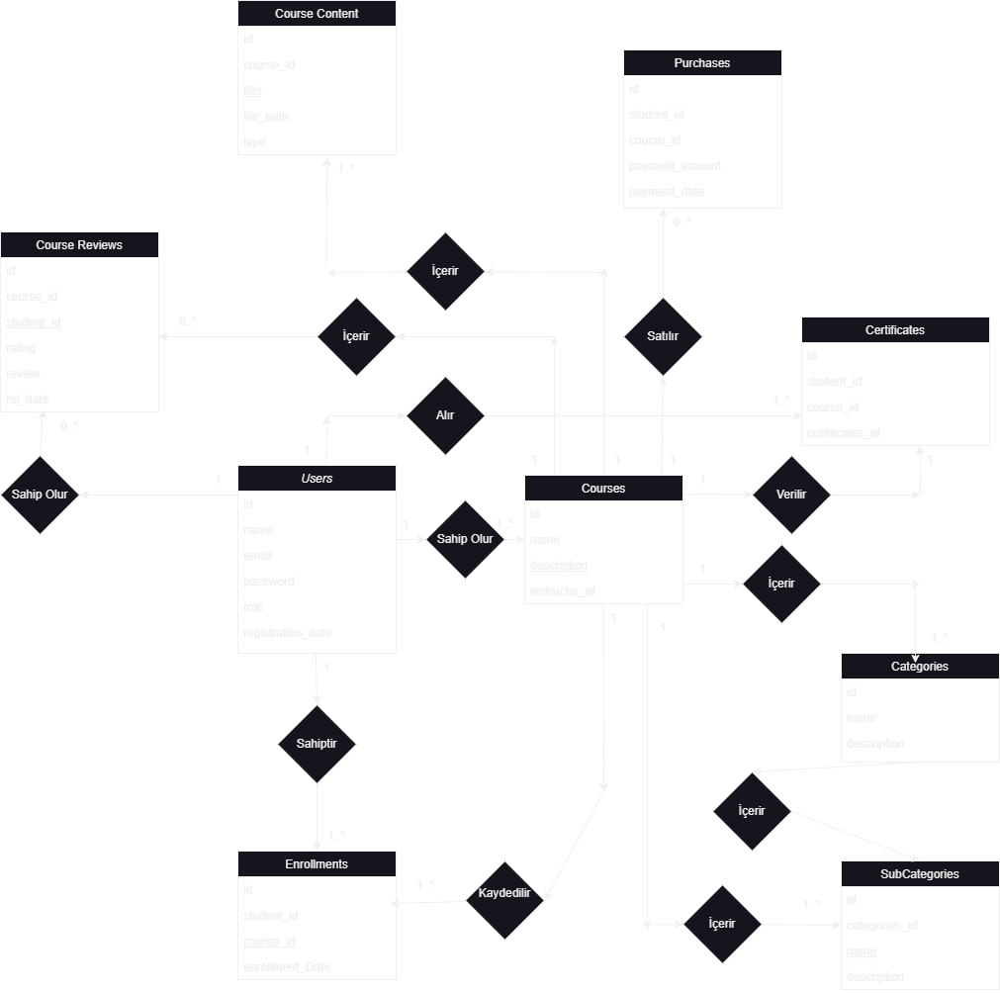

# Proje Adı: Online Egitim Otomasyonu
### Proje Ekibindeki Kişiler:
- 220260023 - Abdulkadir Karataş
- 220260065 - Ömer Erginoğuz
- 220260037 - Ahmet Melik Yıldırım

---

## Gereksinimler
### Öğrenci Gereksinimleri
| Gereksinim                      | Açıklama |
|---------------------------------|----------|
| Kursları Görüntüleme            | Öğrenci, tüm kursları görüntüleyebilir. |
| Kurs Kaydı Yapma                | Öğrenci, ilgilendiği kurslara kayıt olabilir. |
| Satın Alma İşlemleri            | Öğrenci, kurs satın alma işlemlerini gerçekleştirebilir. |
| İçeriklere Erişim               | Öğrenci, satın aldığı veya kayıt olduğu kursların içeriklerine erişebilir. |
| Sertifika Görüntüleme           | Öğrenci, tamamladığı kurslardan aldığı sertifikaları görüntüleyebilir. |
| Değerlendirme Yapma             | Öğrenci, katıldığı kursları değerlendirebilir ve yorum yapabilir. |

### Eğitmen Gereksinimleri
| Gereksinim                  | Açıklama |
|-----------------------------|----------|
| Kurs Ekleyebilme            | Eğitmen, sistemde yeni kurslar oluşturabilir. |
| İçerik Yükleyebilme         | Eğitmen, kurs içeriklerini sisteme yükleyebilir. |
| Kategori ve Alt Kategori Düzenleme | Eğitmen, kursların kategorilerini ve alt kategorilerini düzenleyebilir. |
| Kullanıcı Yönetimi          | Eğitmen, kullanıcı bilgilerini görüntüleyebilir ve yönetebilir. |
| Sertifika Düzenleme         | Eğitmen, tamamlanan kurslara sertifika tanımlayabilir. |

### Yönetici Gereksinimleri
| Gereksinim                  | Açıklama |
|-----------------------------|----------|
| Kullanıcı Yönetimi          | Yönetici sistemdeki tüm kullanıcıları görüntüleyebilir, düzenleyebilir ve silebilir. |
| Kurs Yönetimi               | Admin, tüm kursları görüntüleyebilir, düzenleyebilir ve silebilir. |
| Satın Alma Geçmişi Görüntüleme | Admin, kullanıcıların satın alma geçmişlerini görüntüleyebilir. |
| Raporlana ve İstatistik     | Admin, kurs istatistiklerini ve raporlarını görebilir. |
| İçerik ve Kategori Yönetimi | Admin, kategoriler ve alt kategorilerde düzenlemeler yapabilir (içerik ekleme ve silme). |
| Yorum Yönetimi              | Admin, kurslara yapılan yorumları yönetebilir. |

---

## Varlık ve İlişkiler

| Varlık             | Özellikler                                                  | İlişkiler                                                                                                                                                                                                                                        |
|--------------------|-------------------------------------------------------------|---------------------------------------------------------------------------------------------------------------------------------------------------------------------------------------------------------------------------------------------------|
| **Users**          | `id`, `Name`, `Email`, `Password`, `Role`, `Reg_Date`       | - Sahip Olur (Courses): Bir eğitmen birden fazla kursa sahip olabilir. (1-N)   - Yapar (Purchases): Bir kullanıcı birden fazla satın alım yapabilir. (1-N)   - Sahiptir (Enrollment): Bir kullanıcı birden fazla kursa kaydolabilir. (1:N)   - Alır (Certificates): Bir öğrenci birden fazla sertifikaya sahip olabilir. (1:N) |
| **Courses**        | `id`, `name`, `description`, `instructor_id`                | - İçerir (Course Content): Bir kurs birden fazla içeriğe sahip olabilir. (1:N)   - İçerir (Course Reviews): Bir kurs birden fazla incelemeye sahip olabilir. (1:N)   - İçerir (Category): Bir kategori birden fazla kurs içerir. (1:N)   - İçerir (SubCategories): Bir alt kategori birden fazla kurs içerir. (1:N)   - Kaydedilir (Enrollments): Bir kursa birden fazla öğrenci kaydolabilir. (1:N)   - Satılır (Purchases): Bir kurs birden fazla kez satın alınabilir. (1:N) |
| **Enrollments**    | `id`, `student_id`, `course_id`, `enrollment_date`          | - Bağlantı (Users ve Courses): Öğrencilerin kursa kaydolmasını sağlar. (N:M)                                                                                                                                                                      |
| **Purchases**      | `id`, `student_id`, `course_id`, `payment_amount`, `payment_date` | - Bağlantı (Users ve Courses): Kullanıcıların kurs satın almasını sağlar. (N:M)                                                                                                                                                                    |
| **Certificates**   | `id`, `student_id`, `course_id`, `certificate_id`           | - Verilir (Courses): Bir kurs için birden fazla sertifika verilebilir. (1:N)   - Alınır (Users): Bir öğrenci birden fazla sertifika alabilir. (1:N)                                                                                           |
| **Categories**     | `id`, `name`, `description`                                 | - İçerir (SubCategories): Bir kategori, birden fazla alt kategoriye sahip olabilir. (1:N)                                                                                                                                                         |
| **SubCategories**  | `id`, `categories_id`, `name`, `description`                | - İçerir (Courses): Bir alt kategori, birden fazla kurs içerir. (1:N)                                                                                                                                                                             |
| **Course Content** | `id`, `course_id`, `title`, `file_path`, `type`             | - Bağlıdır (Courses): Bir kursa birden fazla içerik eklenebilir. (1:N)                                                                                                                                                                            |
| **Course Reviews** | `id`, `course_id`, `student_id`, `rating`, `review`, `rev_date` | - Yapılır (Users): Bir kullanıcı birden fazla değerlendirme yapabilir. (1:N)   - Alır (Courses): Bir kurs birden fazla kez değerlendirilebilir. (1:N)                                                                                         |

---

## İlişki Özeti Tablosu

| Tablo 1      | Tablo 2         | Arasındaki İlişki |
|--------------|------------------|--------------------|
| Users        | Courses          | 1-N               |
| Users        | Certificates     | 1-N               |
| Users        | Enrollments      | 1-N               |
| Users        | Course Reviews   | 1-N               |
| Courses      | Course Reviews   | 1-N               |
| Courses      | Course Content   | 1-N               |
| Courses      | Purchases        | 1-N               |
| Courses      | Certificates     | 1-1               |
| Courses      | Enrollments      | 1-N               |
| Categories   | Courses          | 1-N               |
| Categories   | SubCategories    | 1-N               |
| SubCategories | Courses         | 1-N               |

---

## E-R Diyagramı

---
